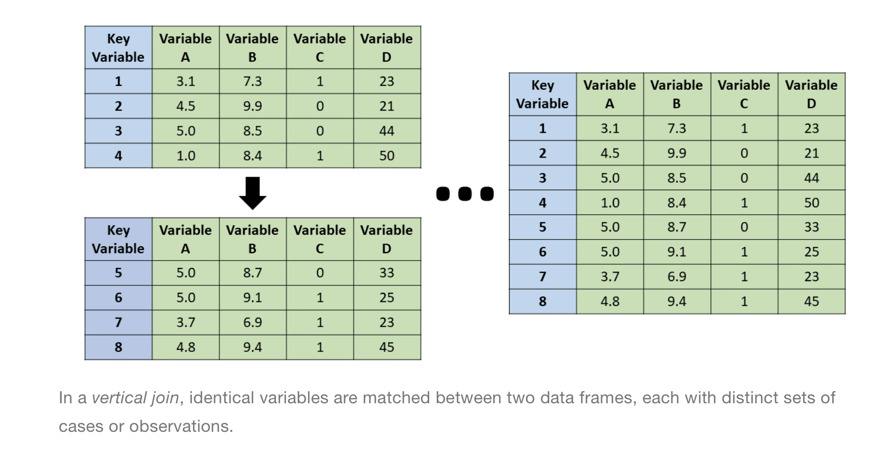

```{r setup, include=FALSE}
knitr::opts_chunk$set(echo = TRUE)
```

# Executive summary: Joining Poverty and Water Quality Data Tables

For Data-412-005: Statistical Programming in R

## Chosen topic and functionality:

I have chosen to cover the concept of joins: R functions that can combine tables together, or filter them against each other, in various ways. Joins use keys - shared columns between tables - to match up observations in the tables. They then either create a new table with a combination of the values in the previous two tables (mutating joins), or remove rows from one of the tables depending on the rows present in the other table (filtering joins). Various joins each handle differences in the keys present in the tables in their own way.

## Data sources:

I will be using two data sources that I will practice joining together. The first data source is a table containing information on poverty levels in different states and is from the United States Census Bureau. The second data source is a table containing information on water quality in various water systems, and is from the EPA.

```{r}

```

```{r}
knitr::include_graphics("../graphics/epa_image.png")
```

## Overall approach:

-   Introduction:

    -   Context and significance (of joins)

    -   Personal motivation (for choosing this topic)

    -   Primary objective (of this lesson)

    -   Key takeaways (of this lesson)

    -   Information on data

        -   What are the data sources?

        -   General nature of variables

        -   Time period of data

-   Data preparation

    -   Description of process (of finding, importing, and cleaning the data)

    -   Code and explanations

-   Main lesson:

    -   What are joins? - The general concept of joins

    -   Keys

        -   Overview

        -   Different variable names - what to do when this happens

        -   Poverty and water quality data example

    -   Mutating joins: joins for combining tables together

        1.  Left joins
        2.  Right joins
        3.  Inner joins
        4.  Full joins

    -   Filtering joins: Joins for filtering tables based on the information in other tables

        1.  semi join
        2.  anti join

-   Conclusion

    -   Primary objective and importance

    -   Key points/main takeaways

-   Follow up resources

-   Appendix: references cited in this tutorial

# Introduction:

## Context and Significance:

Sometimes, you may want to combine the information in two tables together. Perhaps one platform at your company has collected data on customers' satisfaction ratings, while another tracks how much money those customers spend. You might want to compare the values in these tables to see if there appears to be a relationship between measures of customer satisfaction and how much money they spend. Joining the two tables - in this example, the table with customer satisfaction ratings and the table with customer spending rates - can allow you to more easily compare the data.

## Personal Motivation:

I chose this topic because I was struggling to understand it on the homework assignment and did not feel I did a good job. I want to come back stronger and have a solid understanding of this topic, especially as I have heard it is a very important one in data science. Additionally, this is a skill that would have helped me a lot in some of my past volunteer work. I worked with Google Sheets databases for a volunteer organization in high school, and would spend around an hour each month manually entering information into a Google Sheet. While I didn't necessarily mind, I do remember thinking that there had to be a faster way to do it. Joining seems like the solution I wished I had, and so I want to learn how to use it!

## Primary objective:

The primary objective of this lesson is to help the audience understand how joins work and how to use them to combine the information in tables as they desire. The audience hopefully will be able to identify primary and foreign keys, write code to apply joins, and predict the output of those joins.

## Key takeaways:

-   Joins can be used to combine the information (whether through adding or removing rows) in two tables that were originally seperate

-   Keys are used during joins to tell R how to match rows together, which rows to keep, and how to organize information

-   It is very important to confirm, rather than assume, that keys are primary.

-   Mutating joins are used to join databases together. Four types are left joins, right joins, inner joins, and full joins

-   Filtering joins remove rows from a database based on the keys present in anther database. Two types are semi-joins and anti-joins.

## Information on data:

### What are the data sources?

I am using two real world data sources in this lesson. One is SDWIS Federal Reports Search: Water Systems Search Results, a data source that provides information on the water quality of different counties. I got this dataset from [https://sdwis.epa.gov/ords/sfdw_pub/fp=108:103:9855044871709:XLXSM:NO:::](https://sdwis.epa.gov/ords/sfdw_pub/f?p=108:103:9855044871709:XLXSM:NO:::), a website made by EPA (United States Environmental Protection Agency). The other is SAIPE State and County Estimates for 2021, a data source that provides information on the poverty levels of different counties in 2021. I got this dataset from <https://www.census.gov/data/datasets/2021/demo/saipe/2021-state-and-county.html>, a webpage made by the United States Census Bureau.

### General nature of variables:

#### Water system:

(credit to <https://echo.epa.gov/help/facility-search/drinking-water-search-results-help#address> for reference - however I don't think the information here is fully updated as it doesn't fully match the database)

-   PWS_ID:

    -   Unique identifying code of the water system
    -   Class chr

-   PWS_Name:

    -   Name of the water system
    -   Class chr

-   PWS_Type:

    -   Type of water system.

    -   Class chr

    -   Classified as Community Water System, Transient Non-community water system, or transient non-community water system

-   primary_source:

    -   Main source of water, with some exceptions.

    -   Class chr

    -   "Primary Source Water Type categorizes the primary water source for the public water system. the source of water determines treatment requirements, or other standards. For example, the presences of any surface water sources in a public water system's inventory forces a surface water (SW) classification, even though more groundwater may be supplied than surface water. Any groundwater under the influence of surface water sources in a water system inventory necessitates a Ground Water Under the Influence of Surface Water (GUISW) classification. These higher classifications dictate higher monitoring requirements for the water system and greater public health protection."

-   county:

    -   Counties served

    -   Class chr

    -   Counties to which the system provides drinking water.

    -   The documentation is unclear, but potentially in some cases, this could instead be the location of the mailing address of the water system owner.

-   cities_served:

    -   Cities to which the system provides drinking water.

    -   Class chr

    -   The documentation is unclear, but potentially in some cases, this could instead be the location of the mailing address of the water system owner.

-   population_served:

    -   "the estimated average daily population served by a system".
    -   Class dbl

-   num_facilities:

    -   Number of facilities.

    -   Class dbl

    -   Unclear, but appears to be the number of buildings that are used to operate the water system.

-   num_violations:

    -   Number of violations.

    -   Class dbl

    -   Unclear, but appears to be the number of water quality laws that the system has broken.

-   num_site_visits:

    -   Number of site visits.

    -   Class dbl

    -   the number of site visits to the system in the last five years

-   postal_code

    -   Created by me

    -   The first two letters of each row's PWS_ID

    -   Two-letter abbreviation for the state the county is in

    -   Class chr

#### Poverty levels (SAIPE State and County Estimates for 2021) (states and counties):

(credit to <https://www2.census.gov/programs-surveys/saipe/technical-documentation/file-layouts/state-county/2021-estimate-layout.txt> for reference)

-   state_FIPS_code

    -   State FIPS code.

    -   Unique code for each state

    -   Class chr

    -   The state that the county is located in

-   county_FIPS_code

    -   County FIPS code

    -   Unique code for each county

    -   Class chr

-   postal_code

    -   Two-letter abbreviation for the state the county is in
    -   Class chr

-   county

    -   The name of the county, with some exceptions.

    -   Class chr

    -   Each state, as well as the United States, also has it's own row - in these cases the name is the name of the state (or United States) represented by that row.

-   poverty_num_all

    -   Poverty estimate, all ages.

    -   Appears to be the number of people living in poverty in that county (or state or United States).

    -   Class dbl

-   poverty_percent_all

    -   Poverty percent, all ages.

    -   Appears to be the percentage of people living in poverty in that county (or state or United States)

    -   Class dbl

-   poverty_num_0to17

    -   Poverty estimate for people ages 0-17 years old.

    -   Appears to be the number of minors living in poverty in that county (or state or United States)

    -   Class dbl

-   poverty_percent_0to17

    -   Poverty percent for people ages 0-17 years old.

    -   Appears to be the percentage of minors living in poverty in that county (or state or United States)

    -   Class dbl

-   poverty_num_0to17_infams

    -   The documentation states this is the "Estimate of related children age 5-17 in families in poverty".

    -   Based on this description, my guess is that this may be to differentiate such children from children in foster care or emancipated minors so that the poverty statistics for these groups can be compared.

    -   Class dbl

-   poverty_percent_0to17_infams

    -   The documentation states this is the "Estimated percent of related children age 5-17 in families in poverty".

    -   Based on this description, my guess is that this may be to differentiate such children from children in foster care or emancipated minors so that the poverty statistics for these groups can be compared.

    -   Class dbl

-   med_income

    -   Median household income for that county (or state or United States)
    -   Class dbl

-   full_code

    -   full unique code for each county

    -   county FIPS code and state FIPS code concatenated together

    -   Class chr

    -   Created by me

-   Confidence intervals:

    -   For each of the numeric variables, confidence intervals were provided. While I think that these are important data, they contributed to the large size of the data table (31 columns), which I felt might be a difficult size for someone learned joining for the first time. So, I removed these columns from the table.

-   Dropped categories:

    -   There was also data on poverty estimates and rates for children ages 0-4. However, this data was only available at the state level, and so all of the values for county were blank. Since I originally thought county was the foreign key for water systems, I didn't think it made sense to include this data and removed it from the table.

#### Poverty levels (SAIPE State and County Estimates for 2021) (states only):

-   state_FIPS_code

    -   State FIPS code.

    -   Unique code for each state

    -   Class chr

    -   The state that the county is located in

-   postal_code

    -   Two-letter abbreviation for the state the county is in
    -   Class chr

-   name

    -   name of the state (or the United States)

    -   Class chr

-   poverty_num_all

    -   Poverty estimate, all ages.

    -   Appears to be the number of people living in poverty in that county (or state or United States).

    -   Class dbl

-   poverty_percent_all

    -   Poverty percent, all ages.

    -   Appears to be the percentage of people living in poverty in that county (or state or United States)

    -   Class dbl

-   poverty_num_0to17

    -   Poverty estimate for people ages 0-17 years old.

    -   Appears to be the number of minors living in poverty in that county (or state or United States)

    -   Class dbl

-   poverty_percent_0to17

    -   Poverty percent for people ages 0-17 years old.

    -   Appears to be the percentage of minors living in poverty in that county (or state or United States)

    -   Class dbl

-   poverty_num_0to17_infams

    -   The documentation states this is the "Estimate of related children age 5-17 in families in poverty".

    -   Based on this description, my guess is that this may be to differentiate such children from children in foster care or emancipated minors so that the poverty statistics for these groups can be compared.

    -   Class dbl

-   poverty_percent_0to17_infams

    -   The documentation states this is the "Estimated percent of related children age 5-17 in families in poverty".

    -   Based on this description, my guess is that this may be to differentiate such children from children in foster care or emancipated minors so that the poverty statistics for these groups can be compared.

    -   Class dbl

-   med_income

    -   Median household income for that county (or state or United States)
    -   Class dbl

### Time period of data:

-   The water systems data was collected in quarter 3 of 2023.

-   The poverty data was collected in 2021

# Data Preparation

## Description of process:

I am interested in the environment and environmental justice, and so I thought it would be interesting to practice joining data from the US Census and the EPA. At first I found census tables for each state, and water quality data in which you could look up an individual water system. However I wanted to compare them at a national level so I did some digging on the sites until I was able to find national level data. The data tables were provided as excel sheets by the websites. Originally I imported them using readxl, but I read back through the readr notes and noticed that that is not recommended, and we are supposed to convert the excel files to csv files instead and read them in using readr. So I converted the datasets to csv files and read them in. In both the water and poverty datasets, there were a few lines with comments that were messing up the variables, so I added the skip argument to exclude them. In the poverty dataset, NA values were given ".", so I had to use the na argument in read_csv to replace the periods with NA. In both the water system dataset and the poverty dataset, the variable names had spaces in them, so I renamed the variable names using colnames. The poverty dataset had 31 different columns, so I wanted to remove some of them to make it easier to work with. At first I chose to rename the ones I knew I would use and leave the rest as NA. Then I wanted to get rid of the NA columns altogether because having duplicate column names was confusing R. First, I tried using the subset function to make a new table that only contains the variables I want to include. However, R gave me an error message because the column names were missing since I hadn't wanted to type them in due to there being about 30 extra columns I didn't intent to use. So, I tried dropping by index instead. An additional note: I later decided I wanted to go back and use more of the columns, so I renamed the ones I wasn't using to ci1, ci2, etc. (ci standing for confidence interval), and then dropped them. I renamed them this time so that the column names would be assigned to the right columns and not to the columns I wanted to drop.

Additionally, I unfortunately realized that county names are not a primary key for poverty data, so I needed to find a workaround. Originally I added a column to poverty data - full_code - that is the state FIPS code followed by the county FIPS code. This succeeded in building a primary key for poverty data, but I realized I had further problems in that water systems does not have any FIPS codes. Reluctantly, I realized it was out of the scope of my project to join county level data, and so I shifted to examining state level data. I imported and cleaned a version of poverty data that has state as a primary key (this table was provided by the same census website I got my original poverty data from). I also added a new variable - postal_code - to water systems so I could use postal_code as a foreign key for poverty data. I used mutate to make the new variable, and str_sub to take the first two letters of each PWS_ID. (Fortunatley, the first two letter of each PWS_ID is the postal code of the state that water system is located in).

It was a long process to figure out what data tables to use and how to modify them to have the keys I needed, but I learned a lot of technical skills through the process, and also a valuable lesson of never assuming that a variable that *seems* like a primary key is in fact a primary key. I've learned that instead it is extremely important to immedatly use count(primary key) and filter(n \>1) to make sure that there are no duplicate values, instead of waiting until later to check this. This has also taught me valuable lesson about the importance of double checking you assumptions about data, and following best practices on doing so, in general.

## Code and explanations:

I will load the tidyverse library to access a wide variety of helpful functions, including functions for reading in and tidying datasets.

```{r}
library(tidyverse) #loading tidyverse library to access functions
```

First I will import my dataset that provides information on the water quality of different counties. I got this dataset from [https://sdwis.epa.gov/ords/sfdw_pub/fp=108:103:9855044871709:XLXSM:NO:::](https://sdwis.epa.gov/ords/sfdw_pub/f?p=108:103:9855044871709:XLXSM:NO:::), a website made by EPA (United States Environmental Protection Agency).

```{r}

Water_System <- read_csv("../data/Water_System_Summary.csv") #using relative path to read in data

colnames(Water_System) <- c(`PWS ID` = "PWS_ID", `PWS Name` = "PWS_Name", `PWS Type` = "PWS_Type", `Primary Source` = "primary_source", `Counties Served` = "county", `Cities Served` = "cities_served", `Population<br>Served Count` = "population_served", `Number of Facilities` = "num_facilities", `Number of Violations` = "num_violations", `Number of Site Visits` = "num_site_visits") #renaming variables to be easier to type in R

glimpse(Water_System) #observing data
```

Next I will import my dataset that provides information on the poverty levels of different counties. I got this dataset from <https://www.census.gov/data/datasets/2021/demo/saipe/2021-state-and-county.html>, a webpage made by the United States Census Bureau.

```{r}
Poverty_data2 <- read_csv("../data/Poverty_data_all_counties.csv", skip = 3, na = ".") #using relative path to read in data. Also skipping the first three lines, which do not follow the format of the rest of the table. Additionally, replacing . with na. 

colnames(Poverty_data2) <- c("state_FIPS_code", "county_FIPS_code", "postal_code", "county", "poverty_num_all", "ci1", "co2", "poverty_percent_all", "co3", "co4", "poverty_num_0to17", "co4", "co5", "poverty_percent_0to17", "co6", "co7", "poverty_num_0to17_infams", "co8", "co9", "poverty_percent_0to17_infams", "co10", "co11", "med_income") #renaming variables to be easier to type in R

glimpse(Poverty_data2) #observing data
```

I want to remove the columns I am not using. So, I will remove the columns I don't want by identifying them by their index numbers. (Credit to <https://www.listendata.com/2015/06/r-keep-drop-columns-from-data-frame.html> for reference).

```{r}
Poverty_data3 <- Poverty_data2[-c(6:7, 9:10, 12:13, 15:16, 18:19, 21:22, 24:31 )] #removing unwanted columns from poverty data

glimpse(Poverty_data3) #observing results
```

I will import a csv containing just the state-level poverty data

```{r}
state_poverty <- read_csv("../data/est21us.csv", skip = 3, na = ".") #using relative path to read in data. Also skipping the first three lines, which do not follow the format of the rest of the table. Additionally, replacing . with na. 


colnames(state_poverty) <- c("state_FIPS_code", "postal_code", "name", "poverty_num_all", "ci1", "ci2", "poverty_percent_all", "ci3", "ci4", "poverty_num_0to17", "ci4", "ci5", "poverty_percent_0to17", "ci6", "ci7", "poverty_num_0to17_infams", "ci8", "ci9", "poverty_percent_0to17_infams", "ci10", "ci11", "med_income") #renaming variables to be easier to type in R

glimpse(state_poverty) #observing data
```

Removing columns I don't want from state_poverty.

```{r}
state_poverty2 <- state_poverty[-c(5:6, 8:9, 11:12, 14:15, 17:18, 20:21, 23:30 )] #removing unwanted columns from state poverty
glimpse(state_poverty2) #observing results
```

Adding variable for postal codes to water systems:

```{r}
water_systems_states <- Water_System |>
  mutate(postal_code = str_sub(PWS_ID, 1, 2)) #str_sub is taking the first two letters of each PWS_ID. mutate is storing them in there own variable: postal_code

glimpse(water_systems_states) #observing the results
```

# Main lesson

## What are joins?

Joining allows you to combine two tables into one in RStudio by using a "key", or shared set of values between the tables, to match up their observations and then add their values together. You can also use joining to consolidate their information by removing rows from one table based on the rows in the other one. When you are done, you will have one table with the information you desire from both of your original tables.

```{r}

```

Credit to <https://rforhr.com/join.html> for image. See <https://creativecommons.org/licenses/by-nc-sa/4.0/> for reuse license and conditions.

You will want to load the tidyverse library to access the join functions.

```{r}
library(tidyverse) #loading tidyverse library to access join functions
library(dplyr) #loading dplyr library to access functions like piping 
```

In this lesson, we will be joining two tables from two different datasets together. One contains data on water quality, while another contains data on poverty levels. This could be useful if we want to see if there is a relationship between income and water quality.

## Keys

### Overview

In order to combine tables, R needs to know how the observations in the original tables should correspond in the new table - what information to keep, how it should be organized, etc. This is where keys come in.

Keys are columns in a table that uniquely identify each observation in that table. Variables are called primary keys when they uniquely identify the observations in their own table, and foreign keys when they are the same variable as the primary key for another table. To join two tables, R will match up the rows in the tables based on their keys (and the join used) and combine their columns - or remove rows from one of the tables - based on how the keys match up and the type of join used.

### Different variable names

Note: sometimes, while the keys in you tables may represent the same information, the variable names may be different (for example perhaps in two tables measuring employee data, the employees names are the primary key for both tables. However in one table, this variable may be named "names" while in the other table it may be named "first_last"). If you don't want to change the original tables, you can solve this issue by setting the keys equal to each other in by = join_by(). The format is by = join_by("key1" == "key2"), for example by = join_by("names" == "first_last").

### Poverty and water quality data example:

Let's examine our tables to see what their keys are and if they may contain keys for each other.

#### Finding primary key for poverty data:

```{r}
glimpse(Poverty_data3) #this will return the first rows for all of the columns in poverty data
```

It seems like county name might be a key for Poverty data.

Lets check. It's important to check that a variable you suspect is a primary key truly doesn't have any duplicate values in order to avoid problems when joining tables together (namely many-to-many relationships, which we will cover later). In order to check, we can count how many times each value in the suspected key is present. If it really is a primary key, the count for every value should be 1. Then, we can filter the table to only show values that had a count of greater than one, in other words they are repeated. If the key is primary, the output will be a tibble with zero rows. So the format is:

Name of table \|\>

count(suspected primary key) \|\>

filter (n \> 1)

Let's use it to check poverty data:

```{r}
Poverty_data3 |> #we are using Povety_data3 table
  count(county) |> #this creates a tibble of each county name and how many times they are present
  filter(n > 1) #this only shows us rows in the counting tibble which have a count greater than 1 - so it shows county names that are repeated
```

County isn't a key! If it were a key the tibble would have had zero rows. The reason it isn't a key is that there may be different counties in different states with the same name. This may be part of why the government has a FIPS code system. So, let's see if county FIPS code may be a key for Poverty data:

```{r}
Poverty_data3 |> #we are using Povety_data3 table
  count(county_FIPS_code) |>  #this creates a tibble of each county code and how many times they are present
  filter(n > 1) #this only shows us rows in the counting tibble which have a count greater than 1 - so it just shows county codes that are repeated
```

County FIPS code is also not unique for each row! Perhaps the combination of state and county FIPS codes forms a unique key:

```{r}
Poverty_data3 |> #we are using Povety_data3 table
  count(state_FIPS_code, county_FIPS_code) |> #this creates a tibble of how many times each specific combination of state and county codes are present
  filter(n > 1) #this only shows us rows in the counting tibble which have a count greater than 1 - so it just shows combinations of state and county codes that are repeated
```

The combination of state and county FIPS codes uniquely indentify the rows in poverty data, forming a key! In this kind of situation, where a combination of multiple variables form the key for a table, that key is called a compound key.

However, when starting out learning how to join in R, it is probably easiest to form a single key for poverty data. We could use a surrogate key, in which we create a variable containing the number of each row as it's value. However, if we want to join this table with another one to compare data, it may make more sense to combine the codes for state and county FIPS codes together to make a new primary key. (to learn more about how I made this new variable, see the chapters on data transformation (mutate function) and strings (str_c function) in the Data for R textbook linked in appendix.)

Credit to <https://www.sisense.com/blog/when-and-how-to-use-surrogate-keys/> for reference.

```{r}
Poverty_data4 <- Poverty_data3 |> #we are making a new data table and saving it to the name Poverty_data4
  
  mutate(full_code = #we are creating a new column in poverty data with the name full_code.
           str_c(state_FIPS_code, county_FIPS_code))  #str_c is combining state and county codes into one string and saving these values to full_code
```

Let's observe the results:

```{r}
glimpse(Poverty_data4) #this will return the first rows for all of the columns in poverty data
```

It looks like it worked! We can see that we now have a five digit code for each county that looks like it's a combination of the state and county codes.

However, we should still check that the new variable we've created uniquely identifies the observations.

```{r}
Poverty_data4 |> #we are using Povety_data3 table
  count(full_code) |> #this creates a tibble of each full code and how many times they are present
  filter(n > 1) #this only shows us rows in the counting tibble which have a count greater than 1 - so it just shows full codes that are repeated
```

It worked! Since there are no rows in the tibble we know there are no duplicate values. We now have a primary key for Poverty data.

#### Primary key for water system data:

```{r}
glimpse(Water_System) #observing the first rows of each column
```

It looks like PWS_ID might be a key for water systems. Let's check and see!

```{r}
Water_System |> #we are using Water_System table
  count(PWS_ID) |> #this creates a tibble of each PWS_ID and how many times they are present
  filter(n > 1) #this only shows us rows in the counting tibble which have a count greater than 1 - so it just shows PWS_IDs that are repeated
```

Yes, PWS_ID is the key for water systems - the tibble has zero rows.

#### Foreign key for water system:

Now, we have a problem. Water systems does not have any data on FIPS codes, instead it has the names of the counties the water systems are located in. Presumably, there may be multiple water systems located in the same county, leading to multiple entries in water systems for the same county. Lets check:

```{r}
Water_System |> #we are using Water_System table
  count(county) |> #this creates a tibble of each county and how many times they are present
  filter(n > 1) #this only shows us rows in the counting tibble which have a count greater than 1 - so it just shows counties that are repeated
```

Yes, there are many entries for the same counties. This is to be expected given that one county probably need multiple water systems in order to supply all of it's residents with water. So unfortunately, FIPS codes can not act as a foreign key for water systems.

The issue is that when we examined poverty data we found that that there are multiple different counties with the same name in that table as well. So, joining poverty data and water systems by counties could create a many-to-many relationship.

```{r}
left_joined <- left_join(Poverty_data3, Water_System, by = join_by("county")) #here we are testing a join to see if it will work without any error messages. We will cover left joins more in the left joins section
glimpse(left_joined)
```

R flags this join with a warning in the console:

```{r}

```

Many-to-many relationships, in which both keys have the same duplicate values, are usually a serious problem as they cause R to create rows with every possible combination, leading to an unreasonable and inaccurate number of rows. So, this is a situation we should avoid when combining our tables. Unfortunately, comparing counties poverty levels with their water quality levels will not be as feasible as I'd hoped.

#### Searching for a workaround:

As my next attempt, I will try joining poverty data and water quality at the state level.

To start, we will want to examine a version of poverty data I've imported that only contains state level poverty data.

```{r}
glimpse(state_poverty2) #observing state_poverty2
```

It seems like postal code should be a primary key for this table. Let's check:

```{r}
state_poverty2 |> 
  count(postal_code) |> #counting occurances of postal_code values
  filter(n > 1) #filtering to any repeated values
```

There are no duplicate values for postal code, so it is a primary key for state poverty!

Next, we need to add a variable in water systems for postal code to act as a foreign key. The original file does not have a separate variable for postal code. However, the first two letters of PWS_ID appear to be the postal code the facility is located in. We can make a new table containing a new variable with these postal codes (to see how I did this, go to data preparation):

```{r}
glimpse(water_systems_states)
```

Let's check that the tables are able to join:

```{r}
left_join(state_poverty2, water_systems_states, by = join_by ("postal_code"))
```

R no longer places an error message in the console! So, we can use postal code to join the poverty data and water quality data for states!

```{r}
knitr::include_graphics("../graphics/left_join_success.png")
```

#### Importance of confirming a key is primary:

When I originally set up this project, I assumed that county was a primary key for poverty data. This turned out not to be the case, and I could have saved myself a lot of trouble if I had double checked as is recommended! Hopefully this section has shown you the importance of going through the double checking process for primary keys, and broader importance of double checking assumptions you have about your data.

## Mutating Joins: Joins for combining tables together

We will examine four types of joins that combine tables together: inner joins, left joins, right joins, and full joins. Each of these types handles differences in the keys, and how values are copied over, differently.

### Left join:

#### Overview:

Left joins are the most commonly used type of join, and the programmer should think of them as their default option for joining. Left joins keep all of the rows in table x. Then, for each row in table y that has a key that matches with a key in table x, r will add the values in that row of table y to that row in table x. If there is a row in table x with no matching key in table y, r will fill in NA where the values from table y would have been.

```{r}

```

Credit to <https://rforhr.com/join.html> for image. See <https://creativecommons.org/licenses/by-nc-sa/4.0/> for reuse license and conditions.

#### Duplicate values in the keys:

If a value in the key of table x matches multiple values in the key of table y, r will create a row in the new table for each match in y. Each of these rows will have the values from their y row, plus the values and key from the matching x row - the key and information in the x row will be duplicated. If there are duplicate key values for both x and y, that is known as a many-to-many relationship. In this case, R will create rows with every possible combination - this is a situation we usually want to avoid.

#### Coding syntax:

The function left_join() is used to join two tables together. Inside of the left join, we will practice using the following arguments: the name of table x, the name of table y, and the key we will be using to join the tables. When specifying the key we will be using to join the tables, we use the code by = joinby(). Inside of joinby, we place the name of the key in quotes if it is named the same way in both tables, or the names of both of the keys with two equal signs in between if the keys have different names but represent the same variable.

So the format for left joining two tables when the keys have the same name is:

left_join(table x, table y, by = join_by("key name")

And the format for left joining two tables when the keys have different names is:

left_join(table x, table y, by = join_by("key name1 == key name 2")

#### Poverty and water quality data example:

```{r}
left_joined <- left_join(state_poverty2, #table x
                         water_systems_states, #table y
                         by = join_by ("postal_code")) #we are joining the tables by the key/variable postal code
glimpse(left_joined) #observing the result
```

In order to make what is happening in each row more clear, I have created a condensed tibble with five variables (the key, two from poverty data, and two from water systems)

```{r}
left_joined |>
  select(postal_code, poverty_percent_all, med_income, PWS_ID, num_violations) #this only shows the five variables I've selected, that way we can see some of the water systems variables to be able to understand what what is happening in each row
```

As you can see from our table, there were duplicate values for postal code in water systems - for example there used to be just one AL entry in poverty data, and now there are many in the new table. Each of the rows in water systems with a postal code of AL was given it's own row in the new table, and the values from the AL row in poverty data were copied into each of the AL rows in water systems. For example, you can see that Alabama's poverty percent all (16.3) has been copied into each row in which the water system is located in Alabama.

A quirk of the poverty data table lets us see what happens when there is a key value in table x with no matches in table y. Poverty data has a row for the US overall, with poverty and income statistics for the whole US. Since the code for water system are organized by state, there are no codes that start with US. So, no postal_code values in water systems match the US entry in poverty data. You can see that the water systems values for that row are each listed as NA.

### Right join:

#### Overview:

Right joins essentially do the same thing as left joins, but with the x and y tables flipped. So, right joins keep all of the rows in table y. Then, for each row in table x that has a key that matches with a key in table y, r will add the values in that row of table x to that row in table y. However, there is an important difference: right joins still try to keep the order of the x rows fairly intact; any rows in y that don't match a key in x are added to the bottom of the table. If there is a row in table y with no matching key in table x, r will fill in NA where the values from table x would have been.

```{r}

```

Credit to <https://rforhr.com/join.html> for image. See <https://creativecommons.org/licenses/by-nc-sa/4.0/> for reuse license and conditions.

#### Duplicate values in the keys:

It appears that right joins handle duplicate values in keys the same way that left joins do. So, if a value in the key of table x matches multiple values in the key of table y, r will create a row in the new table for each match in y, plus the values and key from the matching x row. Once again, be careful about many-to-many relationships, unless you intend for one to occur.

#### Coding syntax:

The function right_join() works the same way as the left_join() function. So the format for right joining two tables when the keys have the same name is:

right_join(table x, table y, by = join_by("key name")

And the format for right joining two tables when the keys have different names is:

right_join(table x, table y, by = join_by("key name1 == key name 2")

#### Poverty and water quality data example:

```{r}
right_joined <- right_join(state_poverty2, #table x
                           water_systems_states, #table y
                           by = join_by ("postal_code")) #we are joining the tables by the key/variable postal code
glimpse(right_joined) #observing the result
```

```{r}
right_joined |>
  select(postal_code, poverty_percent_all, med_income, PWS_ID, num_violations) #creating smaller table to see right join result in table formate with values for some water systems columns
```

As you can see, the right join has kept each row in poverty data that has a matching key in water systems, and has duplicated the x rows when there are more than one matching y rows. Additionally we can see that right join has kept the original order of poverty data intact as much as possible. This differs from the results of simply using left_join and switching the x and y:

```{r}
switch_x_y <- left_join(water_systems_states, # water systems is now table x
                        state_poverty2, #poverty data is now table y
                        by = join_by ("postal_code")) #we are still joining by the variable/key postal code

switch_x_y |>
  select(postal_code, poverty_percent_all, med_income, PWS_ID, num_violations) #observing condensced table 
```

As you can see in our example, using right join on poverty data and water systems resulted in the original order of the rows in poverty data being maintained as much as possible, while still keeping all the rows in water systems. In contrast, switching the order of poverty data and water systems inside a left join (so that water systems is now x and poverty data is now y) causes the order of the rows in water systems to now be kept as intact as possible. So, when we merely switch x and y in a left join, the order of the original y table is still prioritized. This differs from a right join, in which the order of the x table is still prioritized while keeping all rows in y.

Examining the tail of right_joined lets us see what happens when there is a key value in table y with no matches in table x. (Credit to <https://www.digitalocean.com/community/tutorials/head-and-tail-function-r#> for reference)

```{r}
right_joined |>
  select(postal_code, poverty_percent_all, med_income, PWS_ID, num_violations)|>
  tail(n = 10) #this shows us the last ten rows of the table we made from our right join
```

Because right joins seek to maintain the order of the rows in x (poverty data), we need to go all the way to the bottom of the new table in order to see the extra rows in water systems (y) that did not have a matching key value in x (poverty data). Here we can see that the values from the rows in y (water systems) are present, and the values that would have been copied from poverty data(x) if there had been any matches are marked as NA.

### Inner Join:

#### Overview:

Inner joins keep each row with a key value that is present in both table x and table y. When this condition is met for a row, r will then copy the values from both rows into the new row.

```{r}

```

Credit to <https://rforhr.com/join.html> for image. See <https://creativecommons.org/licenses/by-nc-sa/4.0/> for reuse liscence and conditions.

Duplicate keys are still handled the same. The arguments inside the function call - inner_join() - are also still the same. So the format is still

inner_join(table x, table y, by = join_by("key name")

or

inner_join(table x, table y, by = join_by("key name1 == key name 2").

#### Poverty and water quality data example:

```{r}
inner_joined <- inner_join(state_poverty2, water_systems_states, by = join_by ("postal_code")) #using inner_join() function
inner_joined |>
  select(postal_code, poverty_percent_all, med_income, PWS_ID, num_violations) #showing important output
```

We can see that the row from poverty data with the US postal code is no longer included as it does not have a match in water systems.

Let's look for some of the values from the tail of right joined to see if they are gone now:

```{r}
inner_joined|>
  filter(postal_code == "10") #There was a row in the table from our right join with the postal code "10". Let's filter for rows with that postal code value to see if it's still there
```

```{r}
inner_joined|>
  filter(postal_code == "04") #let's see if the 04 postal code row is still there
```

```{r}
inner_joined|>
  filter(postal_code == "AS") #lets see if the AS postal code row is still there
```

We can see that these values have now been removed from inner_joined because they did not have a match in poverty data.

### Full joins:

#### Overview:

Full joins are sort of the opposite of inner joins. In a full join, every observation from table x or table y is kept. If their keys match up, R will combine their values into one row. If a key in table x or table y does not have a key in the other table, R will still add that key and it's values to the new table, and similarly to left and right joins, R will place NA where ever the values from the other table would have been. Duplicate keys, and arguments for the function - full_join() - are still the same.

```{r}

```

Credit to <https://rforhr.com/join.html> for image. See <https://creativecommons.org/licenses/by-nc-sa/4.0/> for reuse license and conditions.

#### Poverty and water quality data example:

```{r}
full_joined <- full_join(state_poverty2, water_systems_states, by = join_by ("postal_code")) #using full_join() function
full_joined |>
  select(postal_code, poverty_percent_all, med_income, PWS_ID, num_violations) #showing important output
```

We can see that the US row is now included in the table because it doesn't need a match in the water systems.

```{r}
full_joined |>
  select(postal_code, poverty_percent_all, med_income, PWS_ID, num_violations)|>
  tail(n = 10) #this shows us the last ten rows of the table we made from our full join
```

Similarly, the rows in water systems with unexpected postal codes are also included in this table, because they don't need a match in poverty data.

## Filtering joins: joins for filtering a table based on another table

Sometimes, you may wish to remove rows from a table based on whether their keys are contained in another table. This is where filtering joins can be useful. We will cover two types of filtering joins: semi-join and anti-joins.

### Semi-joins:

#### Overview:

In semi joins, R will form a table with all the rows in table x that have a matching key value in table y. It won't include rows from x that don't have a matching key value in y. So, none of the values from table y will be copied over, but the keys in y will determine what rows in x are kept in the new table. Since the information from y won't be copied over, duplicate matches in y won't affect the table; the match in x will be removed either way. Arguments for the function - semi_join() - are still the same.

#### Poverty and water quality data example:

```{r}
semi_joined <- semi_join(state_poverty2, water_systems_states, by = join_by ("postal_code")) #using semi_join() function
glimpse(semi_joined) #observing result
```

We can see that the row from poverty data with the US postal code is no longer included as it does not have a match in water systems. Additonally, none of the values from water system have been added to the table, and the rows in poverty data have not been duplicated.

### Anti-joins:

#### Overview:

Anti-joins are the opposite of semi joins: Anti joins form a table with all the rows in table x that do *not* have a matching key in table y. They won't include rows from x that *do* have a matching key in y. So once again, none of the values from table y will be copied over, but the keys in y will determine what rows in x are kept in the new table. Duplicate matches are handled the same way as in semi-joins, and the arguments for the function - anti_join() - are also still the same.

#### Poverty and water quality data example:

```{r}
anti_joined <- anti_join(state_poverty2, water_systems_states, by = join_by ("postal_code")) #using the anti_join() function
glimpse(anti_joined) #observing the result
```

Now the row from poverty data with the US postal code is the only row in the new table, because it is the only key value (postal code) that does not have any matches in water system. Once again, none of the values from water system have been added to the table, and the rows in poverty data have not been duplicated.

# Conclusion:

## Primary objective and importance:

The primary objective of this lesson is to help the audience understand how joins work and how to use them to combine the information in different tables as they desire. They hopefully will be able to identify primary and foreign keys, write code to apply joins, and predict the output of those joins. This can help you when you want to analyze data from multiple tables and sources.

## Key points/main takeaways:

-   Keys are used to tell R how to match rows together, which rows to keep, and how to organize information

-   It is very important to confirm, rather than assume, that keys are primary.

-   Mutating joins are used to join databases together. Four types are left joins, right joins, inner joins, and full joins

-   Filtering joins remove rows from a database based on the keys present in anther database. Two types are semi-joins and anti-joins.

Visual aide to help remember the different types of joins:

```{r}

```

Credit to <https://intro2r.library.duke.edu/join> for image. See <https://creativecommons.org/licenses/by-nc/4.0/> for reuse license and conditions.

Hopefully during this lesson, you learned how joins work and how to use them. This can save you a great deal of time when you want to combine the information in multiple tables, and allow you to combine larger tables than you would otherwise be able to. Hopefully this will help you analyze multiple data sources in your project and career.

# Follow Up Resources:

-   The textbook *R for Data Science (2e)* has a very helpful section on joining at <https://r4ds.hadley.nz/joins#introduction>. In addition to the concepts covered in this lesson, they cover additional topics including non-equi joins and relational databases, and they also have many exercises you can use to practice your joining skills.

-   The "Data and Maps" section of the United States Census Bureau website, at <https://www.census.gov/data.html>, has many interesting datasets you can use to practice your joining skills and build interesting datasets, as does the data section of the United States Environmental Protection agencies website, at <https://www.epa.gov/data>.

-   The Chapter 17: Joining (Merging) Data, of the online book *R for HR: An Introduction to Human Resource Analytics using R* at <https://rforhr.com/join.html>, has an interesting section on vertical joins. According to the book, these joins do not use keys to add to a table vertically, but instead simply add the rows from the other table underneath the ones from the first one to create a new table that is longer rather than wider. Here is a visualization:

```{r}

```

Credit to <https://rforhr.com/join.html> for image. See <https://creativecommons.org/licenses/by-nc-sa/4.0/> for reuse lisence and conditions.

# Appendix:

Alokin, and melowgs. "How to Insert a Picture in an R Markdown Chunk Using a Relative File Path."*Stack Overflow*, 9 Sept. 2020, stackoverflow.com/questions/63811728/how-to-insert-a-picture-in-an-r-markdown-chunk-using-a-relative-file-path. Accessed 14 Dec. 2023.

Bhalla, Deepanshu. "R: Select or Remove Columns from Data Frame."*Listen Data: Make Your Data Tell a Story*, Raptive, date published unknown, www.listendata.com/2015/06/r-keep-drop-columns-from-data-frame.html. Accessed 10 Dec. 2023.

Caughlin, David E. "Chapter 17 Joining (Merging) Data."*R for HR: An Introduction to Human Resource Analytics Using R*, 13 Sept. 2023, rforhr.com/join.html. Accessed 10 Dec. 2023.

Center for Data and Visualization Sciences. "Join Two Data Frames."*R/Tidyverse/Quarto - Get Started*, Duke University Library, 14 Dec. 2023, intro2r.library.duke.edu/join. Accessed 10 Dec. 2023.

CN, Prajwal. "The Head() and Tail() Function in R - Detailed Reference."*Digital Ocean*, 3 Aug. 2022, www.digitalocean.com/community/tutorials/head-and-tail-function-r#.Accessed 13 Dec. 2023.

Gerard, David. "Data Import."*GitHub*, 12 Oct. 2023, dcgerard.github.io/stat_412_612/lectures/05_eda/05_data_import.pdf.Accessed 10 Dec. 2023.

Gerard, David. "Relational Data."*GitHub*, 19 Oct. 2023, dcgerard.github.io/stat_412_612/lectures/07_joining/07_joining.pdf. Accessed 10 Dec. 2023. 

Sudhanshublaze. "How to Add Header to Dataframe in R?"*Geeks for Geeks*, data published unknown, www.geeksforgeeks.org/how-to-add-header-to-dataframe-in-r/. Accessed 10 Dec. 2023.

United States Census Bureau. "File for the 2021 SAIPE State and County Estimates FTP Directory."*United States Census Bureau*, United States Government, 2021, www2.census.gov/programs-surveys/saipe/technical-documentation/file-layouts/state-county/2021-estimate-layout.txt. Accessed 10 Dec. 2023. 

United States Census Bureau. "SAIPE State and County Estimates for 2021."*United States Census Bureau*, United States Government, 15 Dec. 2022, www.census.gov/data/datasets/2021/demo/saipe/2021-state-and-county.html. Accessed 10 Dec. 2023. 

United States Environmental Protection Agency. "DWIS Federal Reports Search: Water Systems Search Results."*EPA: United States Environmental Protection Agency*, United States Government, Quarter 3 2023, echo.epa.gov/help/facility-search/drinking-water-search-results-help#resultsguide. Accessed 10 Dec. 2023.

United States Environmental Protection Agency. "Search Results Help - Drinking Water."*United States Environmental Protection Agency*, United States Government, 30 Oct. 2023, echo.epa.gov/help/facility-search/drinking-water-search-results-help#address. Accessed 10 Dec. 2023.

Wickham, Hadley, et al. "Joins."*R for Data Science (2e)*, O'Reilly, 18 July 2023, r4ds.hadley.nz/joins#introduction. Accessed 10 Dec. 2023.
